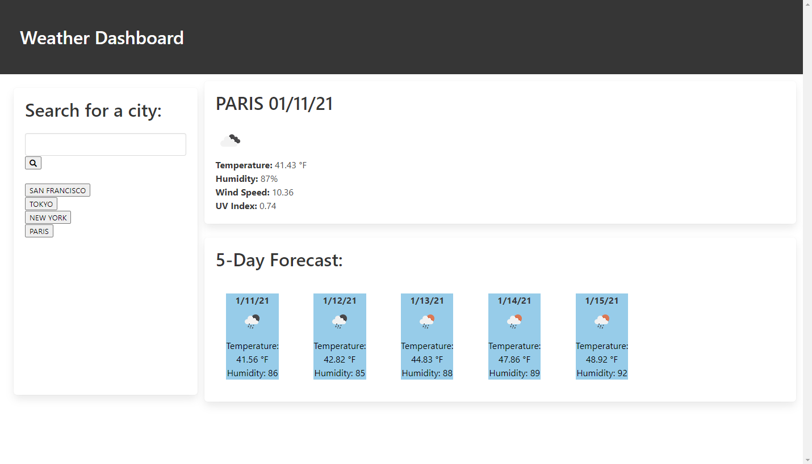

# Weather Dashboard

## Summary
A traveler is looking for a intuitive weather dashboard that they can use to search multiple cities and plan their
trips based on the weather in those cities. 
<br>
<br>

## Site Picture


<br>
<br>

## What Was Done
The general layout was made using Bulma.io rather than the usual Bootstrap. While creating the layout the form area and search button were added to the page. All the weather data is taken directly from the openweathermap web API. As cities are searched by the user, new buttons are added under the search area so the user can check the same data after checking the weather in other cities. Two different API calls are made in this script, one being for a current weather forecast and the other being a five day weather forecast.
<br>
<br>

## Code Snippet
```javascript
buttonPress.on("click", function () {
    userInput = $(".inputSearch").val().trim();
    if (userInput === "") {
        alert("Please enter a city")
    }
    else {
        $(".forecast").empty();
  
        userInput = $(this).siblings(".inputSearch").val().trim().toUpperCase();
        localStorage.setItem(localKey, userInput);
        $(".pastSearches").addClass("past-search").append("<button class= cityButton>" + userInput + "</button> <br>");
        localKey = localKey + 1
        $(".inputSearch").val("");
    }
    searchWeather();
    // Search button function to add search to local storage, create new buttons for those cities and to run 
    // searchWeather() function that appends the data to the page
})
```
This code snippet is the on click function for the initial search made by the user. Everytime the user searches for a city, that city is added to the local storage and a functioning button with the city name is created so the user can still access that cities weather following any future searches.

```javascript
function searchWeather() {
    var queryURL = "https://api.openweathermap.org/data/2.5/weather?q=" + userInput + "&appid=" + apiKey + "&units=imperial";
     
    $.ajax({
        url: queryURL,
        method: "GET"
    }).then(function (response) {
        var cityName = $(".forecast");
        var lat = response.coord.lat;
        var lon = response.coord.lon;
        $(".currentWeather").empty(); 
      
        $(".currentWeather").append("<p> <strong>" + userInput + " " + (moment().format("MM/DD/YY")) + "</p></strong>");
        cityName.append("");
        $("#weatherIcon").attr("src", "http://openweathermap.org/img/wn/"+ response.weather[0].icon + ".png");
        cityName.append("<p><strong>" + "Temperature: </strong>" + response.main.temp + " °F</p>");
        cityName.append("<p><strong>" + "Humidity: </strong>" + response.main.humidity + "%" + "</p>");
        cityName.append("<p><strong>" + "Wind Speed: </strong>" + response.wind.speed + "</p>");
        $.ajax({
            url: "http://api.openweathermap.org/data/2.5/uvi?lat=" + lat + "&lon=" + lon + "&appid=" + apiKey,
            method: "GET"
        }).then(function (response) {
            var uvIndex = cityName.append("<p><strong>" + "UV Index: </strong>" + response.value + "</p>");
            cityName.append(uvIndex);
        })
        $(".columnOne").empty();
        $(".columnTwo").empty();
        $(".columnThree").empty();
        $(".columnFour").empty();
        $(".columnFive").empty();
        fiveDayForecast();
    })
}
```
This code snippet is the main attraction on the script.js file. The searchWeather() function calls the original daily forecast api as well as appending any information for the day onto the given area. At the end of the function it empties the columns that the five day weather forecast is appended to and prints a new five day forecast based on if the user is making a new search of if the user is calling a previous city that they had searched for.
<br>
<br>

## Built With

* [HTML](https://developer.mozilla.org/en-US/docs/Web/HTML)
* [CSS](https://developer.mozilla.org/en-US/docs/Web/CSS)
* [Javascript](https://developer.mozilla.org/en-US/docs/Web/JavaScript)
* [Bulma](https://bulma.io/)
* [OpenWeatherMap] (https://openweathermap.org/api)
* [JQUERY] (https://https://jquery.com/)


<br>
<br>

## Deployed Link

[Live Link "Work Day Scheduler"](https://michaelanthonyyy.github.io/weather-dashboard/)

<br>

## Authors

**Michael Medina** 
- [Link to Github](https://github.com/michaelanthonyyy)
- [Link to LinkedIn](https://www.linkedin.com/in/michael-medina-22aa70200?lipi=urn%3Ali%3Apage%3Ad_flagship3_profile_view_base_contact_details%3B311BosSLTMS4JkhAfkX61A%3D%3D)

<br>

## License
The MIT License (MIT)